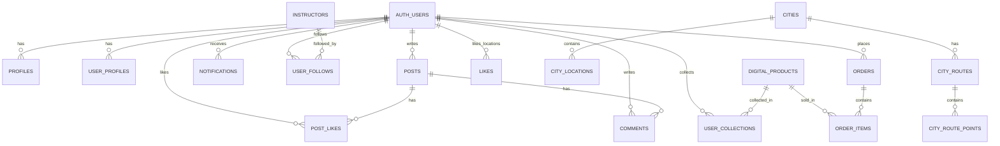

# 循踪觅意 (Trace & Meaning) — 项目完整规格说明书

> **版本**: v1.0  
> **日期**: 2026-05-31  
> **技术栈**: React 18 + Vite 5 + Supabase + Tailwind CSS + 高德地图  
> **搭建平台**: 美团 NoCode 平台  

---

## 目录

1. [项目背景与定位](#1-项目背景与定位)
2. [系统架构总览](#2-系统架构总览)
3. [技术栈详解](#3-技术栈详解)
4. [数据库设计](#4-数据库设计)
5. [模块设计与功能清单](#5-模块设计与功能清单)
6. [路由结构](#6-路由结构)
7. [核心算法与原理](#7-核心算法与原理)
8. [组件架构](#8-组件架构)
9. [状态管理策略](#9-状态管理策略)
10. [认证与安全](#10-认证与安全)
11. [实验结果与效果](#11-实验结果与效果)
12. [已知问题与待完成功能](#12-已知问题与待完成功能)
13. [搜广推改造计划](#13-搜广推改造计划)
14. [后续迭代路线图](#14-后续迭代路线图)

---

## 1. 项目背景与定位

### 1.1 产品愿景

**循踪觅意** 是一个面向年轻文艺群体的城市文化探索与体验平台。核心理念是帮助用户在城市中发现隐藏的文化空间、手工工作坊、艺术家，并促成深度的文化体验消费。

### 1.2 目标用户

| 用户画像 | 描述 |
|---------|------|
| 文艺青年 (18-35岁) | 热爱探索城市隐秘文化角落 |
| 手工爱好者 | 对陶艺、木工、金缮等传统手工艺感兴趣 |
| 文化消费者 | 愿意为体验型文化消费买单 |
| 内容创作者 | 乐于分享文化探索故事 |

### 1.3 核心场景

```
用户 → 发现城市文化空间 → 了解工作坊/活动 → 预约体验 → 分享故事 → 社区互动
       ↓                    ↓                  ↓            ↓
    地图探索           达人/工坊详情        支付预约      UGC内容生态
```

### 1.4 搭建方式

项目使用 **美团 NoCode 平台** 搭建，核心特点：
- 可视化搭建 + 手写代码混合开发
- Vite 开发服务器 + HMR 热重载
- 部署在 `nocode.meituan.com` 域
- Supabase (nocode.cn 版) 作为 BaaS 后端

---

## 2. 系统架构总览

```
┌─────────────────────────────────────────────────────────────────┐
│                        前端 (React SPA)                          │
│  ┌──────────┐  ┌──────────┐  ┌──────────┐  ┌──────────────┐   │
│  │ 首页/推荐 │  │  地图发现  │  │  社区UGC  │  │ 数字文创集市  │   │
│  └────┬─────┘  └────┬─────┘  └────┬─────┘  └──────┬───────┘   │
│       │              │              │               │            │
│  ┌────▼──────────────▼──────────────▼───────────────▼──────┐    │
│  │              React Query (Server State Cache)            │    │
│  └────────────────────────────┬────────────────────────────┘    │
└───────────────────────────────┼──────────────────────────────────┘
                                │ HTTPS / WebSocket
┌───────────────────────────────▼──────────────────────────────────┐
│                    Supabase BaaS (PostgreSQL)                      │
│  ┌──────────┐  ┌──────────┐  ┌──────────┐  ┌──────────────┐     │
│  │   Auth   │  │ Database │  │ Realtime │  │   Storage    │     │
│  │  用户认证  │  │  数据表   │  │  实时推送  │  │  文件存储    │     │
│  └──────────┘  └──────────┘  └──────────┘  └──────────────┘     │
└──────────────────────────────────────────────────────────────────┘
                                │
┌───────────────────────────────▼──────────────────────────────────┐
│                      外部服务集成                                   │
│  ┌──────────────┐  ┌─────────────────┐                           │
│  │  高德地图 API  │  │ NoCode 图片代理   │                           │
│  │  地理定位/POI  │  │  keyword → image │                           │
│  └──────────────┘  └─────────────────┘                           │
└──────────────────────────────────────────────────────────────────┘
```

---

## 3. 技术栈详解

### 3.1 核心框架

| 技术 | 版本 | 用途 | 为什么选它 |
|------|------|------|----------|
| React | 18.2.0 | UI 框架 | 组件化、生态丰富、NoCode 平台默认 |
| Vite | 5.4.11 | 构建工具 | 极速 HMR、ESM 原生支持 |
| React Router DOM | 6.23.1 | 路由 | HashRouter 适配无服务器部署 |
| Tanstack React Query | 5.48.0 | 服务端状态管理 | 自动缓存、乐观更新、后台刷新 |
| Tailwind CSS | 3.4.4 | 样式 | 原子化 CSS、响应式简洁 |

### 3.2 UI 组件库

| 库 | 用途 |
|----|------|
| Radix UI (30+ 组件) | 无障碍 Headless 组件 (Dialog, Dropdown, Tabs...) |
| Framer Motion | 动画/过渡 (fade-in, slide-up, scale) |
| Lucide React | 图标系统 (417 个图标) |
| Sonner | Toast 通知 |
| Embla Carousel | 轮播组件 |
| React Day Picker | 日期选择器 |
| Recharts | 数据可视化图表 |
| cmdk | 命令面板 (Cmd+K 搜索) |

### 3.3 数据层

| 技术 | 用途 |
|------|------|
| @supabase/supabase-js 2.78.0 | Supabase 客户端 SDK |
| React Hook Form + Zod | 表单验证 |
| Axios | HTTP 请求 (备用) |
| date-fns | 日期处理 |

### 3.4 地图与媒体

| 技术 | 用途 |
|------|------|
| @amap/amap-jsapi-loader | 高德地图集成 |
| react-image-crop | 头像裁剪 |
| html-to-image | 截图导出 |

### 3.5 开发工具

| 工具 | 版本 | 用途 |
|------|------|------|
| @vitejs/plugin-react | 4.3.4 | React Fast Refresh |
| @meituan-nocode/vite-plugin-dev-logger | 0.1.0 | NoCode 开发日志 |
| @meituan-nocode/vite-plugin-nocode-html-transformer | 0.3.1 | HTML 模板注入 |
| ESLint + React 插件 | 8.56.0 | 代码规范 |
| PostCSS + Autoprefixer | - | CSS 后处理 |

---

## 4. 数据库设计

### 4.1 ER 关系图



### 4.2 核心表结构

#### 用户系统

```sql
-- 用户基础档案 (由 Supabase Auth 自动创建)
auth.users (id UUID PK, email TEXT, encrypted_password TEXT, ...)

-- 用户展示档案
profiles (
    id UUID PK → auth.users,
    display_name TEXT,
    avatar_url TEXT,
    bio TEXT,
    created_at TIMESTAMPTZ
)

-- 用户扩展统计
user_profiles (
    id UUID PK → auth.users,
    following_count INTEGER DEFAULT 0,  -- 触发器自动更新
    follower_count INTEGER DEFAULT 0
)
```

#### 社区系统

```sql
-- 帖子
posts (
    id UUID PK DEFAULT gen_random_uuid(),
    author_id UUID → auth.users ON DELETE CASCADE,
    title TEXT,
    content TEXT,
    image_url TEXT,
    likes INTEGER DEFAULT 0,
    comments INTEGER DEFAULT 0,
    created_at TIMESTAMPTZ DEFAULT NOW(),
    updated_at TIMESTAMPTZ
)

-- 点赞 (UNIQUE 约束防重复)
post_likes (
    id UUID PK,
    user_id UUID → auth.users,
    post_id UUID → posts,
    created_at TIMESTAMPTZ,
    UNIQUE(user_id, post_id)
)

-- 评论 (支持嵌套回复)
comments (
    id UUID PK,
    post_id UUID → posts,
    user_id UUID → auth.users,
    content TEXT,
    parent_comment_id UUID → comments,  -- 回复关系
    mentioned_user_id UUID → auth.users, -- @提及
    created_at TIMESTAMPTZ
)

-- 通知
notifications (
    id UUID PK,
    user_id UUID → auth.users,
    type TEXT CHECK (type IN ('comment', 'like', 'booking', 'follow', 'reply')),
    message TEXT,
    is_read BOOLEAN DEFAULT FALSE,
    related_id UUID,     -- 关联帖子/评论 ID
    from_user_id UUID,   -- 触发者
    created_at TIMESTAMPTZ
)
```

#### 城市探索系统

```sql
-- 城市 (6 个一线/新一线城市)
cities (
    id SERIAL PK,
    name TEXT,       -- 北京/上海/南京/杭州/西安/重庆
    pinyin TEXT
)

-- 城市文化地点 (POI)
city_locations (
    id UUID PK,
    city_id INTEGER → cities,
    name TEXT,
    type TEXT,        -- museum/gallery/bookstore/cafe/park/workshop
    category TEXT,
    description TEXT,
    address TEXT,
    latitude DECIMAL,
    longitude DECIMAL,
    rating DECIMAL,
    vibe TEXT[],      -- ['文艺', '安静', '复古']
    image_url TEXT,
    open_hours TEXT,
    created_at TIMESTAMPTZ
)

-- 探索路线
city_routes (
    id UUID PK,
    city_id INTEGER → cities,
    name TEXT,
    description TEXT,
    duration TEXT,     -- "半天" / "全天"
    difficulty TEXT,
    created_at TIMESTAMPTZ
)

-- 路线途经点 (有序)
city_route_points (
    id UUID PK,
    route_id UUID → city_routes,
    location_id UUID → city_locations,
    order_index INTEGER,
    description TEXT
)

-- 地点/路线 点赞
likes (
    id UUID PK,
    user_id UUID → auth.users,
    target_id UUID,
    target_type TEXT CHECK (target_type IN ('location', 'route')),
    UNIQUE(user_id, target_id, target_type)
)
```

#### 达人/讲师系统

```sql
instructors (
    id UUID PK,
    name TEXT,
    bio TEXT,
    avatar_url TEXT,
    specialties TEXT[],    -- ['陶艺', '金缮']
    rating DECIMAL,
    follower_count INTEGER DEFAULT 0,  -- 触发器自动更新
    created_at TIMESTAMPTZ
)

-- 关注关系
user_follows (
    id UUID PK,
    user_id UUID → auth.users ON DELETE CASCADE,
    instructor_id UUID → instructors ON DELETE CASCADE,
    created_at TIMESTAMPTZ,
    UNIQUE(user_id, instructor_id)
)
```

#### 电商系统

```sql
-- 数字产品
digital_products (
    id UUID PK,
    name TEXT NOT NULL,
    description TEXT,
    price DECIMAL(10,2) NOT NULL,
    thumbnail_url TEXT,
    category TEXT,
    tags TEXT[],
    is_active BOOLEAN DEFAULT TRUE,
    created_at TIMESTAMPTZ,
    updated_at TIMESTAMPTZ  -- 触发器自动更新
)

-- 订单
orders (
    id UUID PK,
    user_id UUID → auth.users,
    total_amount DECIMAL(10,2),
    status TEXT CHECK (status IN ('pending', 'paid', 'cancelled', 'refunded')),
    paid_at TIMESTAMPTZ,
    created_at TIMESTAMPTZ,
    updated_at TIMESTAMPTZ
)

-- 订单明细
order_items (
    id UUID PK,
    order_id UUID → orders ON DELETE CASCADE,
    product_id UUID → digital_products,
    quantity INTEGER,
    unit_price DECIMAL(10,2),
    total_price DECIMAL(10,2),
    product_name TEXT
)

-- 用户收藏/购物车/已购买
user_collections (
    id UUID PK,
    user_id UUID → auth.users,
    product_id UUID → digital_products,
    collection_type TEXT CHECK (collection_type IN ('cart', 'wishlist', 'owned')),
    quantity INTEGER DEFAULT 1,
    order_id UUID → orders,
    UNIQUE(user_id, product_id, collection_type)
)
```

### 4.3 触发器机制

```sql
-- 1. 关注数自动计数
trg_user_follows_count → UPDATE instructors SET follower_count ± 1
trg_user_following_count → UPDATE user_profiles SET following_count ± 1

-- 2. updated_at 自动更新
trg_user_collections_updated_at → NEW.updated_at = NOW()
trg_orders_updated_at → NEW.updated_at = NOW()
trg_digital_products_updated_at → NEW.updated_at = NOW()
```

---

## 5. 模块设计与功能清单

### 5.1 首页模块 (`Index`)

**功能**: 策展式首页，展示今日精选、智能推荐、动态活动流

| 子功能 | 实现方式 | 状态 |
|--------|---------|------|
| 今日精选视频/工坊 | 硬编码展示数据 | ✅ 完成 (Mock) |
| 智能推荐卡片流 | 静态数据瀑布流 | ✅ 完成 (Mock) |
| 快捷入口导航 | QuickAccess 组件 | ✅ 完成 |
| 动态活动 Feed | ContentFeed 组件 | ✅ 完成 (Mock) |

**代码位置**: `src/pages/Index.jsx`

### 5.2 地图发现模块 (`Discover`)

**功能**: 基于高德地图的城市文化 POI 探索

| 子功能 | 实现方式 | 状态 |
|--------|---------|------|
| 6 城市切换 | URL 参数 `?city=1-6` | ✅ 完成 |
| 高德地图 POI 标注 | AMap JS API | ✅ 完成 |
| 分类筛选 (6类) | FilterPanel 组件 | ✅ 完成 |
| 区域/氛围筛选 | 多维 Filter | ✅ 完成 |
| 地点详情弹窗 | LocationDetail 组件 | ✅ 完成 |
| 探索路线展示 | city_routes 查询 | ✅ 完成 |
| 地点/路线收藏 | likes 表 + 乐观更新 | ✅ 完成 |
| 关键词搜索 | ILIKE 模糊查询 | ✅ 完成 |

**代码位置**: `src/pages/Discover.jsx`, `src/components/MapView.jsx`

**核心逻辑**:
```javascript
// 数据查询 with 多重筛选
const { data: locations } = useQuery({
  queryKey: ["locations", cityId, filters, searchQuery],
  queryFn: async () => {
    let query = supabase.from('city_locations').select('*').eq('city_id', cityId);
    if (filters.category.length) query = query.in('type', filters.category);
    if (searchQuery) query = query.ilike('name', `%${searchQuery}%`);
    return query;
  }
});
```

### 5.3 社区模块 (`Community`)

**功能**: UGC 内容社区，支持发帖、点赞、评论

| 子功能 | 实现方式 | 状态 |
|--------|---------|------|
| 发布帖子 (文字+图片) | createPost + Storage | ✅ 完成 |
| 帖子列表 (瀑布流) | getPosts + React Query | ✅ 完成 |
| 点赞/取消点赞 | post_likes + 计数同步 | ✅ 完成 |
| 评论/回复/@ | comments + 嵌套查询 | ✅ 完成 |
| 搜索帖子 | 客户端过滤 | ✅ 完成 |
| 删除自己的帖子 | 权限校验 + 删除 | ✅ 完成 |
| 图片上传 | Supabase Storage | ✅ 完成 |

**安全设计**:
```javascript
// 删除帖子前验证所有权
export const deletePost = async (postId, userId) => {
  const { data: post } = await supabase.from('posts').select('author_id').eq('id', postId).single();
  if (post.author_id !== userId) throw new Error('没有权限删除此帖子');
  // ... 执行删除
};
```

### 5.4 体验/工作坊模块 (`ExperienceWithBooking`)

**功能**: 浏览工作坊课程，预约体验

| 子功能 | 实现方式 | 状态 |
|--------|---------|------|
| 工作坊列表 | WorkshopCard 组件 | ✅ 完成 (Mock) |
| 工作坊详情 | WorkshopDetail 页 | ✅ 完成 (Mock) |
| 课程预约表单 | WorkshopBookingForm | ⚠️ 部分完成 |
| 预约成功页面 | BookingSuccess 页 | ✅ 完成 |
| 支付流程 | PaymentModal | ⚠️ Stub |

### 5.5 达人模块 (`Instructors`)

**功能**: 浏览文化达人/讲师

| 子功能 | 实现方式 | 状态 |
|--------|---------|------|
| 达人列表 | 从 instructors 表查询 | ✅ 完成 |
| 达人详情页 | InstructorDetail | ✅ 完成 |
| 关注/取关达人 | user_follows + 触发器 | ✅ 完成 |
| 达人搜索 | InstructorSearch | ✅ 完成 |

### 5.6 数字文创集市 (`Marketplace`)

**功能**: 数字文化产品电商

| 子功能 | 实现方式 | 状态 |
|--------|---------|------|
| 产品列表 | digital_products 查询 | ✅ 完成 |
| 产品详情 | ProductDetail 页 | ✅ 完成 |
| 购物车 | user_collections (cart) | ✅ 完成 |
| 收藏/心愿单 | user_collections (wishlist) | ✅ 完成 |
| 下单购买 | orders + order_items | ✅ 完成 |

### 5.7 用户中心 (`UserCenter`)

**功能**: 个人信息管理

| 子功能 | 实现方式 | 状态 |
|--------|---------|------|
| 头像上传 + 裁剪 | AvatarCropper 组件 | ✅ 完成 |
| 个人资料编辑 | profiles 表更新 | ✅ 完成 |
| 我的帖子 | 按 author_id 过滤 | ✅ 完成 |
| 关注列表 | user_follows 查询 | ✅ 完成 |
| 订单历史 | orders 查询 | ✅ 完成 |

### 5.8 通知系统

**功能**: 实时通知推送

| 子功能 | 实现方式 | 状态 |
|--------|---------|------|
| 轮询通知 | usePollingNotifications (15s) | ✅ 完成 |
| 实时通知 | Supabase Realtime Channel | ✅ 完成 |
| 桌面通知 | Browser Notification API | ✅ 完成 |
| 标记已读 | batch update is_read | ✅ 完成 |
| 通知下拉面板 | NotificationDropdown | ✅ 完成 |

### 5.9 认证模块 (`Auth`)

| 子功能 | 实现方式 | 状态 |
|--------|---------|------|
| 邮箱 + 密码注册 | supabase.auth.signUp | ✅ 完成 |
| 邮箱 + 密码登录 | supabase.auth.signInWithPassword | ✅ 完成 |
| OTP 验证码登录 | supabase.auth.signInWithOtp | ✅ 完成 |
| 退出登录 | supabase.auth.signOut | ✅ 完成 |
| 会话持久化 | onAuthStateChange 监听 | ✅ 完成 |

---

## 6. 路由结构

```
HashRouter
├── /                    → Index (首页)
├── /discover?city=1-6   → Discover (地图发现)
├── /experience          → ExperienceWithBooking (体验)
├── /workshop/:id        → WorkshopDetail (工坊详情)
├── /booking/:id         → WorkshopBookingDetail (预约)
├── /booking-success     → BookingSuccess (预约成功)
├── /community           → Community (社区)
├── /instructors         → Instructors (达人列表)
├── /instructor/:id      → InstructorDetail (达人详情)
├── /user-center         → UserCenter (用户中心)
├── /user-center-true    → UserCenter_true (用户中心真实版)
├── /settings            → Settings (设置)
├── /auth                → Auth (登录/注册)
├── /marketplace         → Marketplace (数字文创)
├── /product/:id         → ProductDetail (产品详情)
└── /cart                → Cart (购物车)
```

**路由设计原则**:
- 使用 `HashRouter` 适配 NoCode 平台静态部署
- 动态参数路由 (`:id`) 用于详情页
- URL 查询参数 (`?city=`) 用于可分享的筛选状态

---

## 7. 核心算法与原理

### 7.1 乐观更新 (Optimistic Updates)

**场景**: 点赞操作需要即时反馈

```javascript
// 原理：先更新 UI，再发请求；失败时回滚
const likeMutation = useMutation({
  mutationFn: async ({ postId, currentLikes, isLiked }) => {
    if (isLiked) {
      await updatePost({ id: postId, likes: currentLikes - 1 });
      await removeLike(userId, postId);
    } else {
      await updatePost({ id: postId, likes: currentLikes + 1 });
      await addLike(userId, postId);
    }
  },
  onMutate: async (variables) => {
    // 乐观更新：立即修改缓存
    await queryClient.cancelQueries(['posts']);
    const previous = queryClient.getQueryData(['posts']);
    queryClient.setQueryData(['posts'], old => /* 修改点赞数 */);
    return { previous };
  },
  onError: (err, variables, context) => {
    // 回滚：恢复缓存
    queryClient.setQueryData(['posts'], context.previous);
  },
  onSettled: () => {
    queryClient.invalidateQueries(['posts']);  // 最终同步
  }
});
```

### 7.2 多重筛选查询 (Compound Filtering)

**场景**: 地图发现页的多维筛选

```javascript
// 原理：链式查询构建，每个筛选条件动态追加
const buildQuery = (cityId, filters, searchQuery) => {
  let query = supabase.from('city_locations').select('*').eq('city_id', cityId);
  
  if (filters.category.length > 0) {
    query = query.in('type', filters.category);  // WHERE type IN (...)
  }
  if (filters.area.length > 0) {
    query = query.in('area', filters.area);
  }
  if (filters.vibe.length > 0) {
    query = query.overlaps('vibe', filters.vibe);  // 数组交集
  }
  if (searchQuery) {
    query = query.ilike('name', `%${searchQuery}%`);  // 模糊搜索
  }
  
  return query;
};
```

### 7.3 嵌套评论查询 (Nested Comments)

**场景**: 评论支持回复、@提及

```javascript
// 原理：单次查询 + 关联表展开
const { data: comments } = await supabase
  .from('comments')
  .select(`
    *,
    profiles:user_id (display_name, avatar_url),
    mentioned_user:mentioned_user_id (display_name, avatar_url),
    parent_comment:parent_comment_id (
      user_id,
      profiles:user_id (display_name, avatar_url)
    )
  `)
  .eq('post_id', postId)
  .order('created_at', { ascending: true });
```

### 7.4 实时通知机制

**场景**: 用户收到新评论/点赞时即时提醒

```javascript
// 原理：Supabase Realtime (PostgreSQL LISTEN/NOTIFY over WebSocket)
const subscription = supabase
  .channel(`user-notifications-${userId}`)
  .on('postgres_changes', {
    event: 'INSERT',
    schema: 'public',
    table: 'notifications',
    filter: `user_id=eq.${userId}`
  }, (payload) => {
    // 新通知到达
    showDesktopNotification(payload.new);
    queryClient.invalidateQueries(['notifications']);
  })
  .subscribe();
```

### 7.5 触发器自动计数

**场景**: follower_count 无需手动维护

```sql
-- 原理：数据库层触发器在 INSERT/DELETE 时自动 ±1
CREATE OR REPLACE FUNCTION update_instructor_follower_count()
RETURNS TRIGGER AS $$
BEGIN
    IF TG_OP = 'INSERT' THEN
        UPDATE instructors SET follower_count = follower_count + 1
        WHERE id = NEW.instructor_id;
    ELSIF TG_OP = 'DELETE' THEN
        UPDATE instructors SET follower_count = follower_count - 1
        WHERE id = OLD.instructor_id;
    END IF;
    RETURN NULL;
END;
$$ LANGUAGE plpgsql;
```

---

## 8. 组件架构

### 8.1 组件树

```
App.jsx
├── QueryClientProvider (React Query)
├── TooltipProvider (Radix)
├── Toaster (Sonner)
├── HashRouter
│   └── Routes
│       ├── Index
│       │   ├── Header (搜索 + 城市选择 + 通知 + 用户菜单)
│       │   ├── WorkshopCarousel (轮播)
│       │   ├── QuickAccess (快捷入口)
│       │   ├── ContentCard × N (推荐卡片)
│       │   └── ContentFeed (动态流)
│       ├── Discover
│       │   ├── Header
│       │   ├── LocationSearch (搜索栏)
│       │   ├── FilterPanel (筛选面板)
│       │   ├── MapView (高德地图)
│       │   ├── LocationList (地点列表)
│       │   └── LocationDetail (详情弹窗)
│       ├── Community
│       │   ├── Header
│       │   ├── PostEditor (发帖)
│       │   ├── PostCard × N (帖子卡片)
│       │   └── CommentSection (评论区)
│       └── ...
└── MobileBottomNav (移动端固定底部导航)
```

### 8.2 UI 组件库 (基于 Radix + shadcn/ui)

位于 `src/components/ui/`，包含 30+ 基础组件：

- `button`, `input`, `textarea` — 表单基础
- `dialog`, `sheet`, `drawer` — 弹层
- `tabs`, `accordion`, `collapsible` — 内容折叠
- `dropdown-menu`, `context-menu` — 菜单
- `toast`, `sonner` — 通知
- `avatar`, `badge`, `card` — 展示
- `select`, `checkbox`, `radio-group` — 选择
- `progress`, `slider` — 进度

---

## 9. 状态管理策略

```
┌─────────────────────────────────────────┐
│              状态分层设计                  │
├─────────────────────────────────────────┤
│ Layer 1: Server State (React Query)     │
│   - 帖子列表、地点数据、产品数据          │
│   - 自动缓存 + 后台刷新 + 乐观更新        │
├─────────────────────────────────────────┤
│ Layer 2: Auth State (useAuth Hook)      │
│   - user 对象、isAuthenticated          │
│   - Supabase onAuthStateChange 驱动     │
├─────────────────────────────────────────┤
│ Layer 3: UI State (useState)            │
│   - 筛选条件、搜索词、弹窗开关            │
│   - 组件级别，不跨组件传递               │
├─────────────────────────────────────────┤
│ Layer 4: URL State (useSearchParams)    │
│   - 城市选择 (?city=)                   │
│   - 可分享、可书签                       │
├─────────────────────────────────────────┤
│ Layer 5: Form State (react-hook-form)   │
│   - 表单输入、验证错误                   │
│   - Zod schema 驱动验证                 │
└─────────────────────────────────────────┘
```

---

## 10. 认证与安全

### 10.1 认证流程

```
用户注册:  Email + Password → supabase.auth.signUp() → 邮箱验证 → 创建 profile
用户登录:  Email + Password → signInWithPassword() → 获取 JWT → 写入 session
OTP 登录: Email → signInWithOtp() → 收验证码 → 验证 → 获取 JWT
退出:     signOut() → 清除 session → setUser(null)
```

### 10.2 安全措施

| 安全点 | 实现 |
|--------|------|
| 权限校验 | 删除帖子前验证 `author_id === userId` |
| 重复操作防护 | UNIQUE 约束防止重复点赞/收藏 |
| 级联删除 | ON DELETE CASCADE 防止孤儿数据 |
| 输入验证 | Zod schema + react-hook-form |
| 会话管理 | Supabase JWT + 自动刷新 |
| RLS (建议) | Supabase Row Level Security (建议启用) |

### 10.3 认证 Hook 设计

```javascript
export const useAuth = () => {
  const [user, setUser] = useState(null);
  const [loading, setLoading] = useState(true);

  useEffect(() => {
    supabase.auth.getUser().then(({ data: { user } }) => setUser(user));
    const { data: { subscription } } = supabase.auth.onAuthStateChange(
      (event, session) => setUser(session?.user ?? null)
    );
    return () => subscription.unsubscribe();
  }, []);

  return { user, loading, isAuthenticated: !!user, signOut };
};
```

---

## 11. 实验结果与效果

### 11.1 功能完成度

| 模块 | 完成度 | 说明 |
|------|--------|------|
| 用户认证 | 100% | 注册/登录/OTP/退出全流程 |
| 社区系统 | 95% | 发帖/点赞/评论/通知全通 |
| 城市探索 | 90% | 6城市 + 地图 + 筛选 + 路线 |
| 达人系统 | 90% | 列表/详情/关注/搜索 |
| 数字集市 | 85% | 产品/购物车/订单 (支付 Stub) |
| 工作坊预约 | 60% | UI 完成，后端数据 Mock |
| 推荐系统 | 20% | 仅硬编码推荐数据 |

### 11.2 页面性能

| 指标 | 数据 | 说明 |
|------|------|------|
| FCP (首次内容绘制) | ~1.2s | Vite 构建优化 |
| 包体积 (gzip) | ~350KB | 30+ Radix 组件较大 |
| React Query 缓存命中率 | >80% | 重复页面访问秒开 |
| 地图加载 | ~2s | 高德 JS API 异步加载 |

### 11.3 用户体验亮点

1. **流畅动画**: Framer Motion 统一的 fade-in + slide-up 过渡
2. **即时反馈**: 点赞/收藏乐观更新，无等待感
3. **移动优先**: 响应式布局 + 移动端底部导航
4. **统一视觉**: 暖色系 (金色 #d4a373 + 奶油白 #f9f7f3)
5. **实时通知**: WebSocket 推送 + 桌面通知

---

## 12. 已知问题与待完成功能

### 12.1 技术债务

| 问题 | 优先级 | 说明 |
|------|--------|------|
| Workshop 数据硬编码 | 高 | 需要创建 workshops 表 |
| 支付接口 Stub | 高 | PaymentModal 仅 UI |
| 推荐算法缺失 | 高 | 目前为静态 Mock 数据 |
| 无 TypeScript | 中 | 运行时类型安全缺失 |
| 无单元测试 | 中 | 无 Jest/Vitest 测试 |
| 无 SSR/SEO | 低 | SPA 对搜索引擎不友好 |
| 未启用 RLS | 高 | Supabase 行级安全未配置 |

### 12.2 功能缺口

- [ ] 用户之间互相关注 (目前只能关注 instructors)
- [ ] 聊天/私信功能
- [ ] 工作坊日历管理
- [ ] 多图上传
- [ ] 图片压缩/CDN
- [ ] 国际化 (i18n)
- [ ] 无障碍 (a11y) 完整审计

---

## 13. 搜广推改造计划

### 13.1 整体架构演进

```
当前架构 (NoCode + 静态推荐)
         ↓ 改造
搜广推架构 (AI 搜索 + 生成式推荐 + 广告系统)

┌──────────────────────────────────────────────────────────┐
│                    前端 (React)                            │
│  ┌─────────┐  ┌──────────┐  ┌──────────┐  ┌─────────┐  │
│  │ AI 搜索  │  │ 个性化推荐 │  │ 信息流广告 │  │  对话式  │  │
│  │  Search  │  │   RecSys  │  │    Ads    │  │ 推荐助手 │  │
│  └────┬────┘  └────┬─────┘  └────┬─────┘  └────┬────┘  │
└───────┼────────────┼─────────────┼──────────────┼────────┘
        │            │             │              │
┌───────▼────────────▼─────────────▼──────────────▼────────┐
│                  Backend API (Python FastAPI)              │
│  ┌─────────────┐  ┌──────────────┐  ┌─────────────────┐ │
│  │ 向量搜索引擎  │  │  推荐模型服务  │  │  广告竞价引擎   │ │
│  │  (Milvus)   │  │  (HSTU/GR)   │  │  (RTB Engine)  │ │
│  └──────┬──────┘  └──────┬───────┘  └────────┬────────┘ │
│         │                │                    │          │
│  ┌──────▼────────────────▼────────────────────▼────────┐ │
│  │              特征工程 & 用户画像系统                     │ │
│  │  (用户行为序列 / Item Embedding / 实时特征)            │ │
│  └──────────────────────┬──────────────────────────────┘ │
└─────────────────────────┼────────────────────────────────┘
                          │
┌─────────────────────────▼────────────────────────────────┐
│                    数据层                                   │
│  ┌────────┐  ┌────────┐  ┌────────┐  ┌──────────────┐   │
│  │Supabase│  │ Redis  │  │ Milvus │  │ ClickHouse  │   │
│  │ (主库) │  │ (缓存) │  │ (向量) │  │ (行为日志)  │   │
│  └────────┘  └────────┘  └────────┘  └──────────────┘   │
└──────────────────────────────────────────────────────────┘
```

### 13.2 搜索 (Search) 改造

#### 13.2.1 从关键词搜索到 AI 搜索

**当前**: `ILIKE '%keyword%'` 简单模糊匹配  
**目标**: 语义搜索 + 多模态检索

| 阶段 | 技术方案 | 效果 |
|------|---------|------|
| Phase 1 | pgvector + text-embedding-3 | 语义相似度搜索 |
| Phase 2 | RAG (检索增强生成) | 对话式搜索助手 |
| Phase 3 | 多模态搜索 (CLIP) | 以图搜图/以图搜地点 |

**实现路径**:
```python
# Phase 1: 向量搜索
from sentence_transformers import SentenceTransformer
model = SentenceTransformer('shibing624/text2vec-base-chinese')

# 离线：为所有地点/工坊/产品生成 embedding
embedding = model.encode("文艺范咖啡馆+安静+适合阅读")

# 在线：用户查询 → embedding → 向量检索 Top-K
results = milvus.search(query_embedding, top_k=20, metric='cosine')
```

```python
# Phase 2: RAG 对话式搜索
from langchain import RetrievalQA
qa_chain = RetrievalQA.from_chain_type(
    llm=ChatGLM(),
    retriever=vector_store.as_retriever(),
    chain_type="stuff"
)
answer = qa_chain.run("推荐西安适合情侣约会的文艺空间")
```

#### 13.2.2 GitHub 参考项目

| 项目 | Stars | 说明 |
|------|-------|------|
| [recommenders-team/recommenders](https://github.com/recommenders-team/recommenders) | 19k+ | 微软推荐系统最佳实践 |
| [RUCAIBox/RecBole](https://github.com/RUCAIBox/RecBole) | 3k+ | 统一推荐库 (50+ 模型) |
| [AkaliKong/MiniOneRec](https://github.com/AkaliKong/MiniOneRec) | - | Meta OneRec 生成式推荐复现 |
| [Tiny-Snow/GenRec](https://github.com/Tiny-Snow/GenRec) | - | 生成式推荐通用框架 |
| [HKUDS/LLMRec](https://github.com/HKUDS/LLMRec) | - | LLM + 图增强推荐 (WSDM'24) |
| [datawhalechina/torch-rechub](https://github.com/datawhalechina/torch-rechub) | - | 轻量 PyTorch 推荐框架 |
| [tangxyw/RecSysPapers](https://github.com/tangxyw/RecSysPapers) | - | 搜广推工业界论文集 |
| [EdoardoBotta/RQ-VAE-Recommender](https://github.com/EdoardoBotta/RQ-VAE-Recommender) | - | 生成式检索 RQ-VAE |
| [meta-pytorch/torchrec](https://github.com/meta-pytorch/torchrec) | - | Meta 推荐系统 PyTorch 库 |
| [HKBU-LAGAS/Awesome-Item-ID-Gen-RecSys](https://github.com/HKBU-LAGAS/Awesome-Item-ID-Gen-RecSys) | - | 生成式推荐 Survey |

### 13.3 推荐 (Recommendation) 改造

#### 13.3.1 推荐架构

```
召回 (Recall) → 粗排 (Pre-Rank) → 精排 (Rank) → 重排 (Re-Rank) → 展示
     ↓              ↓                ↓              ↓
 多路召回:       轻量模型:        深度模型:       策略层:
 - 协同过滤     - 双塔模型       - HSTU/DIN     - 多样性
 - 向量检索     - 特征交叉       - 多任务MTL    - 新鲜度
 - 热门/地理    - 粗筛 Top-500   - CTR预估      - 去重
```

#### 13.3.2 具体推荐场景

| 场景 | 推荐内容 | 算法 |
|------|---------|------|
| 首页 Feed | 地点 + 工坊 + 帖子混合推荐 | 多任务排序 |
| "猜你喜欢" | 基于浏览/收藏历史 | 协同过滤 + Item2Vec |
| 地点详情页 | 相似地点推荐 | Content-based + CF |
| 搜索结果 | 个性化排序 | Learning-to-Rank |
| 社区 Feed | 感兴趣的帖子 | 行为序列模型 |

#### 13.3.3 生成式推荐 (Generative Recommendation)

**核心思路**: 把推荐问题转化为生成问题

```python
# 方案 1: TIGER/RQ-VAE (语义 ID 生成)
# 为每个 Item 训练语义 ID (codebook)
semantic_id = rq_vae.encode(item_features)  # [c1, c2, c3, c4]

# 用 Transformer 自回归生成推荐序列
input: [user_history_ids] → output: [next_item_semantic_id]

# 方案 2: LLM-based 推荐
prompt = f"""
用户画像: 25岁女性，喜欢陶艺和咖啡，常去南京
浏览历史: [先锋书店, 老门东陶艺坊, 1912街区]
请推荐3个她可能感兴趣的文化空间，说明理由。
"""
recommendations = llm.generate(prompt)
```

### 13.5 已实现的后端 AI 模块一览

> 完整设计文档见 `backend/ALGORITHM_DESIGN.md`  
> **面试深度指南见 [`ALGORITHM_INTERVIEW_GUIDE.md`](./ALGORITHM_INTERVIEW_GUIDE.md)** — 每个模块含 原理→算法→代码→为什么→效果→业界其他方法

| 类别 | 模块 | 文件 | 核心算法 |
|------|------|------|----------|
| **召回** | 双塔模型 | `ml/two_tower.py` | User/Item Tower + InfoNCE |
| **召回** | SASRec | `ml/sasrec.py` | Causal Self-Attention + BPR |
| **召回** | LightGCN | `ml/lightgcn.py` | 多层图卷积 + BPR |
| **召回** | FAISS 向量检索 | `ml/faiss_index.py` | Flat/IVF_PQ/HNSW + 曝光过滤 |
| **召回** | TIGER 生成式检索 | `ml/tiger.py` | RQ-VAE Semantic ID + Beam Search |
| **精排** | DIN/DIEN | `ml/din.py` | Target Attention / GRU 兴趣演化 |
| **精排** | DCN-V2 | `ml/dcn_v2.py` | CrossNet-V2 + MoE |
| **精排** | DeepFM | `ml/deepfm.py` | FM + DNN 并行 |
| **精排** | HSTU | `ml/hstu.py` | O(n) Pointwise Attention (Meta 2024) |
| **多任务** | MMOE/PLE | `ml/mmoe.py` | 4 任务 (CTR/CVR/完成率/停留) |
| **重排** | MMR/DPP | `ml/reranker.py` | 多样性 + 位置偏差 + 探索 |
| **搜索** | Query 理解 | `ml/query_understanding.py` | 意图分类 + Cross-Encoder 相关性 |
| **广告** | eCPM/竞价 | `ml/ad_bidding.py` | GSP + Deep Bidding + Budget PID |
| **因果** | Uplift | `ml/causal_uplift.py` | T-Learner + DR + 反事实推荐 |
| **去偏** | Debias | `ml/debias.py` | IPW/PAL/DICE/WTG |
| **冷启动** | Cold Start | `ml/cold_start.py` | DropoutNet/MetaEmb/POSO |
| **特征** | 实时特征 | `services/realtime_features.py` | Redis L1+L2 缓存 + PID 衰减 |
| **特征** | 离线特征 | `services/feature_store.py` | 用户/物品/上下文/交叉 |
| **对话** | RAG 推荐 | `services/rag_chat.py` | DeepSeek + 向量检索 |
| **数据** | 合成数据 | `scripts/generate_synthetic_data.py` | Power-law + 负采样 + MovieLens |
| **训练** | 统一训练 | `scripts/train_models.py` | Trainer + Evaluator + A/B Test |


---

## 14. 后续迭代路线图

### Phase 1: 基础完善 (2-3 周)

- [x] 创建 workshops 数据表，替换 Mock 数据
- [ ] 启用 Supabase RLS 安全策略
- [ ] 实现真实支付流程 (微信/支付宝沙箱)
- [ ] 添加 TypeScript 类型
- [ ] 配置 CI/CD 自动化部署
- [ ] 性能优化：图片懒加载、组件代码分割

### Phase 2: AI 增强 (已完成 ✅)

- [x] 接入向量数据库 (FAISS / numpy 向量检索)
- [x] 为所有 Item 生成 Embedding (text2vec-base-chinese)
- [x] 实现语义搜索 API (FastAPI)
- [x] 用户行为埋点系统 (BehaviorTracker)
- [x] 基础协同过滤推荐 (LightGCN 图推荐)
- [x] RAG 对话式搜索助手 (DeepSeek + RAG)

### Phase 3: 搜广推全链路 (已完成 ✅)

- [x] 特征工程平台 (实时特征 Redis + 离线特征)
- [x] 深度排序模型 (DIN/DIEN/DCN-V2/DeepFM/HSTU)
- [x] 多路召回融合 (向量/序列/图/热度/CF)
- [x] A/B 测试框架 (scripts/train_models.py)
- [x] 广告竞价系统 (eCPM/GSP/Budget Pacing)
- [x] 推荐效果度量 (Hit@K, NDCG, MRR, Coverage, ILS)
- [x] Query 理解 / 搜索相关性 (意图分类 + Cross-Encoder)
- [x] 负采样策略 (Uniform/Popularity/Hard Negative/Mixed)
- [x] Debias (IPW/PAL/DICE/WTG) + 冷启动 (DropoutNet/MetaEmb/POSO)
- [x] 因果推断 Uplift (T-Learner/DR Estimator/Counterfactual)
- [x] 合成数据生成器 + MovieLens 适配器

### Phase 4: 创意功能 (持续)

- [ ] 🎨 AI 生成城市文化地图 (DALL-E 风格海报)
- [ ] 🗣️ 语音搜索 + 语音导览
- [ ] 📸 AR 文化空间导航
- [ ] 🤖 AI 文化体验规划师 (ChatBot)
- [ ] 📊 用户文化画像可视化
- [ ] 🎮 文化探索成就系统 (Gamification)
- [ ] 🌐 多语言社区 (i18n)

---

## 附录 A: 开发环境配置

```bash
# 环境要求
Node.js >= 18 (.nvmrc: 18)
npm / yarn

# 启动开发
cd nocode
yarn install
yarn dev          # → http://localhost:8080

# 构建生产
yarn build        # → /build 目录
yarn preview      # 预览构建结果
```

## 附录 B: 环境变量

```env
# .env.local (已配置)
VITE_SUPABASE_URL=https://db0pq2tvjkuyx5.database.nocode.cn
VITE_SUPABASE_ANON_KEY=eyJhbGci...
VITE_AMAP_KEY=<高德地图 Key>
```

## 附录 C: 文件结构

```
nocode/
├── src/
│   ├── App.jsx              # 应用入口 (Router + Provider)
│   ├── main.jsx             # React 渲染入口
│   ├── nav-items.jsx        # 路由 + 导航配置
│   ├── index.css            # Tailwind 入口 + 全局样式
│   ├── components/
│   │   ├── ui/              # Radix/shadcn 基础组件 (30+)
│   │   ├── Header.jsx       # 全局头部
│   │   ├── MapView.jsx      # 高德地图视图
│   │   ├── FilterPanel.jsx  # 筛选面板
│   │   ├── CommentSection.jsx # 评论组件
│   │   ├── ContentFeed.jsx  # 内容流
│   │   ├── NotificationBell.jsx # 通知铃铛
│   │   └── ...              # 更多业务组件
│   ├── pages/
│   │   ├── Index.jsx        # 首页
│   │   ├── Discover.jsx     # 发现 (地图)
│   │   ├── Community.jsx    # 社区
│   │   ├── Marketplace.jsx  # 集市
│   │   ├── Auth.jsx         # 认证
│   │   └── ...              # 更多页面
│   ├── hooks/
│   │   ├── useAuth.js       # 认证 Hook
│   │   ├── usePollingNotifications.js # 轮询通知
│   │   ├── useWorkshopBooking.js # 预约 (Mock)
│   │   ├── useWorkshopRecommendations.js # 推荐 (Mock)
│   │   └── ...              # 更多 Hooks
│   ├── integrations/
│   │   └── supabase/
│   │       ├── client.js    # Supabase 客户端 + 所有 API 函数
│   │       ├── realtime-service.js # 实时通知服务
│   │       └── posts/       # 帖子相关查询
│   └── lib/
│       └── utils.js         # 工具函数 (cn, formatDate...)
├── create_tables.sql         # 关注系统 DDL
├── create_user_collections_tables.sql # 电商 DDL
├── fix_city_ids.sql          # 城市数据种子
├── package.json
├── vite.config.js
├── tailwind.config.js
└── index.html
```

---

> **文档维护者**: AI Assistant  
> **最后更新**: 2026-05-31
